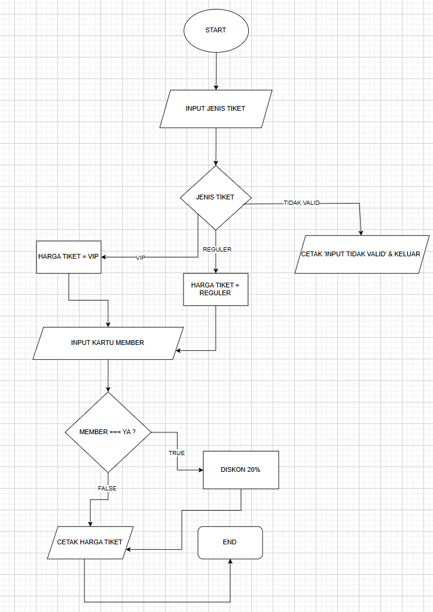
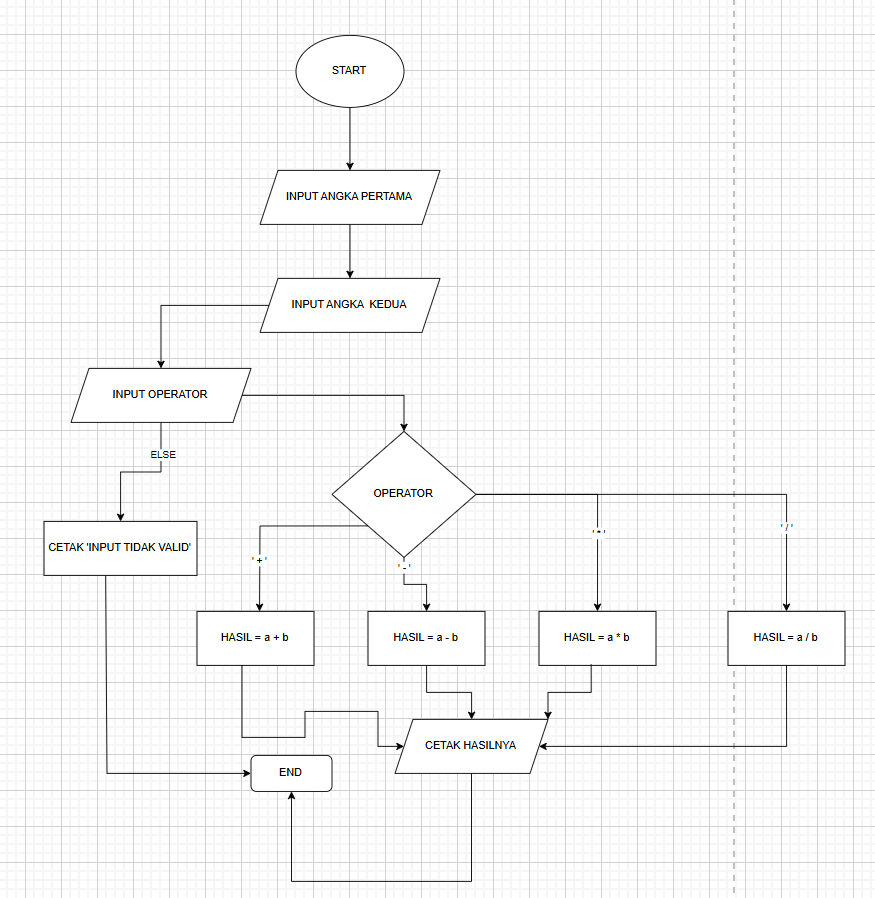

## Nama:Muhamad abdu
## Kelas:TI.24.A1
# lapy02

# Flowchart Diskon Tiket

# Flowchart Kalkulator

# Progam Harga Tiket
   # Codingan
'''python
reguler = 50000
vip = 100000
discount = 0.2

tipe_tiket = input('tipe tiket(reguler/vip :)' )
status_member = input('apakah mempunyai member(iya/tidak :)')

if tipe_tiket == 'reguler':
    harga_tiket = reguler
elif tipe_tiket == 'vip':
    harga_tiket = vip
else :
    print('tiket tidak valid')
    exit()

print(f"harga_tiket {harga_tiket}")

# Penjelasan:
Berikut adalah penjelasan tentang kode yang Anda berikan:

1. Inisialisasi Variabel:
   python
   reguler = 50000
   vip = 100000
   discount = 0.2
   
   - reguler: Harga tiket reguler adalah 50.000.
   - vip: Harga tiket VIP adalah 100.000.
   - discount: Diskon yang diatur (20%) tetapi saat ini belum digunakan dalam kode.

2. Input Pengguna:
   python
   tipe_tiket = input('tipe tiket(reguler/vip :)')
   status_member = input('apakah mempunyai member(iya/tidak :)')
   
   - Kode ini meminta pengguna untuk memasukkan jenis tiket yang ingin dibeli (apakah reguler atau VIP) dan apakah mereka memiliki status anggota (member) atau tidak.

3. Penentuan Harga Tiket:
   python
   if tipe_tiket == 'reguler':
       harga_tiket = reguler
   elif tipe_tiket == 'vip':
       harga_tiket = vip
   else:
       print('tiket tidak valid')
       exit()
   
   - Kode ini memeriksa jenis tiket yang dimasukkan pengguna.
   - Jika pengguna memilih 'reguler', harga tiket ditetapkan ke nilai reguler (50.000).
   - Jika pengguna memilih 'vip', harga tiket ditetapkan ke nilai vip (100.000).
   - Jika pengguna memasukkan nilai selain 'reguler' atau 'vip', program mencetak pesan bahwa tiket tidak valid dan keluar dari program.

4. Output Harga Tiket:
   python
   print(f"harga_tiket {harga_tiket}")
   
   - Kode ini mencetak harga tiket yang telah ditentukan berdasarkan input pengguna.

Kesimpulan
Program ini sederhana, meminta pengguna memilih jenis tiket dan memvalidasi pilihan tersebut sebelum mencetak harga tiket yang sesuai. Namun, meskipun ada variabel untuk diskon, diskon tersebut tidak diterapkan dalam kode saat ini.

# Program Kalkulator

def kalkulator(a, b, operator):
    if operator == '+':
        return a + b
    elif operator == '-':
        return a - b
    elif operator == '*':
        return a * b
    elif operator == '/':
        return a / b
    else:
        print("Input tidak valid")
        exit()
    
a = int(input("Masukan angka pertama: "))
b = int(input("Masukan angka kedua: "))
operator = input ("Masukan operator '+', '-', '*', atau '/'") 

hasil = kalkulator(a, b, operator)
print(f"Hasilnya adalah : {hasil}")

## Penjelasan:
Fungsi kalkulator(a, b, operator)

    Definisi Fungsi: Fungsi kalkulator menerima tiga parameter: dua angka (a dan b) dan sebuah string (operator) yang menunjukkan operasi yang akan dilakukan.

    Pengkondisian:
        Penjumlahan: Jika operator adalah '+', fungsi mengembalikan hasil penjumlahan a + b.
        Pengurangan: Jika operator adalah '-', fungsi mengembalikan hasil pengurangan a - b.
        Perkalian: Jika operator adalah '*', fungsi mengembalikan hasil perkalian a * b.
        Pembagian: Jika operator adalah '/', fungsi mengembalikan hasil pembagian a / b.
        Input Tidak Valid: Jika operator tidak cocok dengan salah satu dari empat pilihan di atas, fungsi mencetak pesan "Input tidak valid" dan menghentikan program menggunakan exit().

Input dan Output

    Input Pengguna:
        a = int(input("Masukan angka pertama: ")): Mengambil input dari pengguna dan mengonversinya menjadi integer untuk angka pertama.
        b = int(input("Masukan angka kedua: ")): Mengambil input untuk angka kedua dengan cara yang sama.
        operator = input("Masukan operator '+', '-', '*', atau '/'"): Mengambil input untuk operator.

    Memanggil Fungsi:
        hasil = kalkulator(a, b, operator): Memanggil fungsi kalkulator dengan argumen yang telah diambil dari input pengguna dan menyimpan hasilnya dalam variabel hasil.

    Menampilkan Hasil:
        print(f"Hasilnya adalah : {hasil}"): Mencetak hasil perhitungan ke layar dalam format yang telah ditentukan.

Ringkasan

Kode ini adalah sebuah kalkulator sederhana yang bisa melakukan operasi dasar (penjumlahan, pengurangan, perkalian, dan pembagian) berdasarkan input pengguna. Jika pengguna memasukkan operator yang tidak valid, program akan menghentikan eksekusinya dengan memberikan pesan kesalahan.

